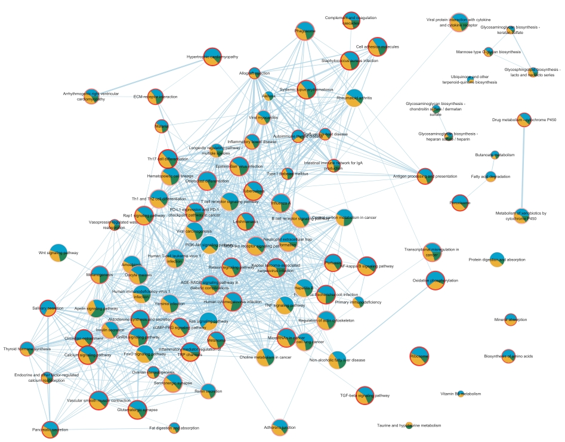

# MOPA : Multi-Omics Pathway Analysis

MOPA (Multi-Omics Pathway Analysis) is a tool for analysis pathway with single wise score with multi-omics. Also analysis pathway with omics unit and gene unit.
Providing visualization with pathway score and network and survival analyis.
Tutorial data can be downloaded in https://cobi.knu.ac.kr/tools.php

Below figure is an workflow method of MOPA
## Tutorial using colon cancer data (TCGA-COAD)

