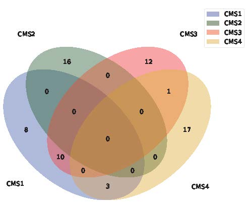
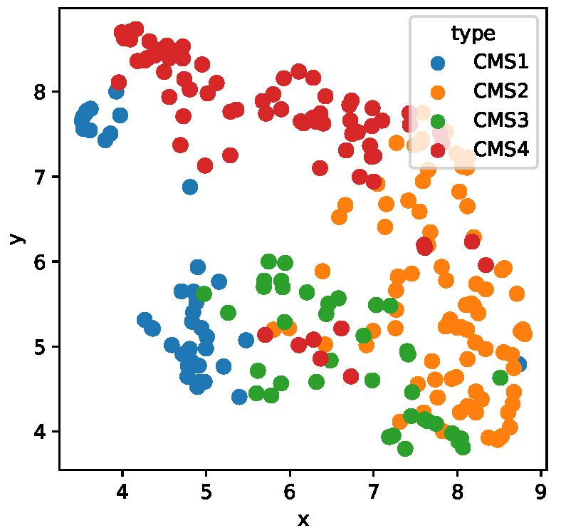

# MOPA : Multi-Omics Pathway Analysis

MOPA (Multi-Omics Pathway Analysis) is a tool for analysis pathway with single wise score with multi-omics. Also analysis pathway with omics unit and gene unit.
Providing visualization with pathway score and network and survival analyis.

Below figure is an workflow method of MOPA
# 

## Tutorial using colon cancer data (TCGA-COAD)

